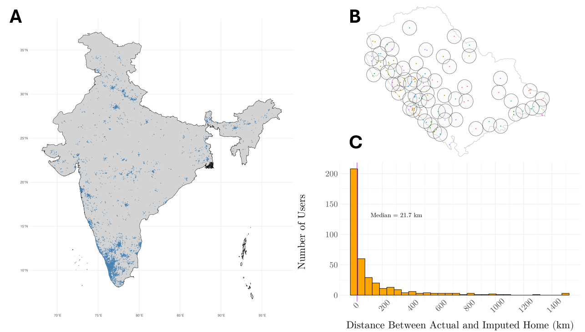
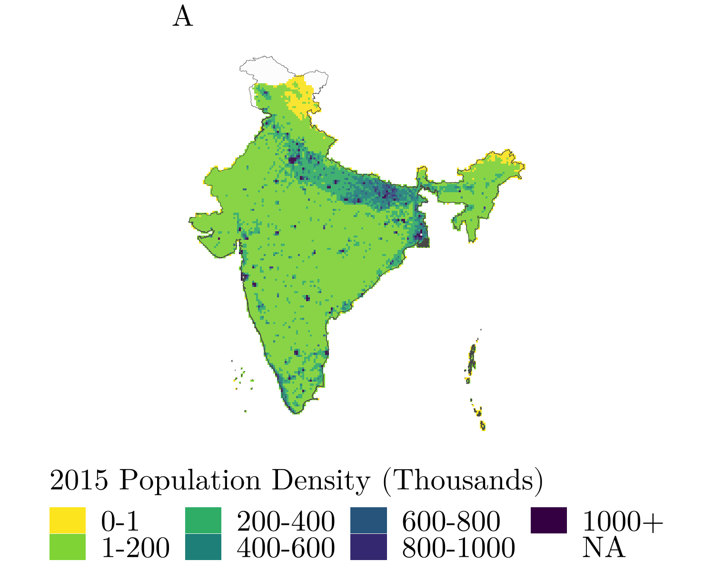
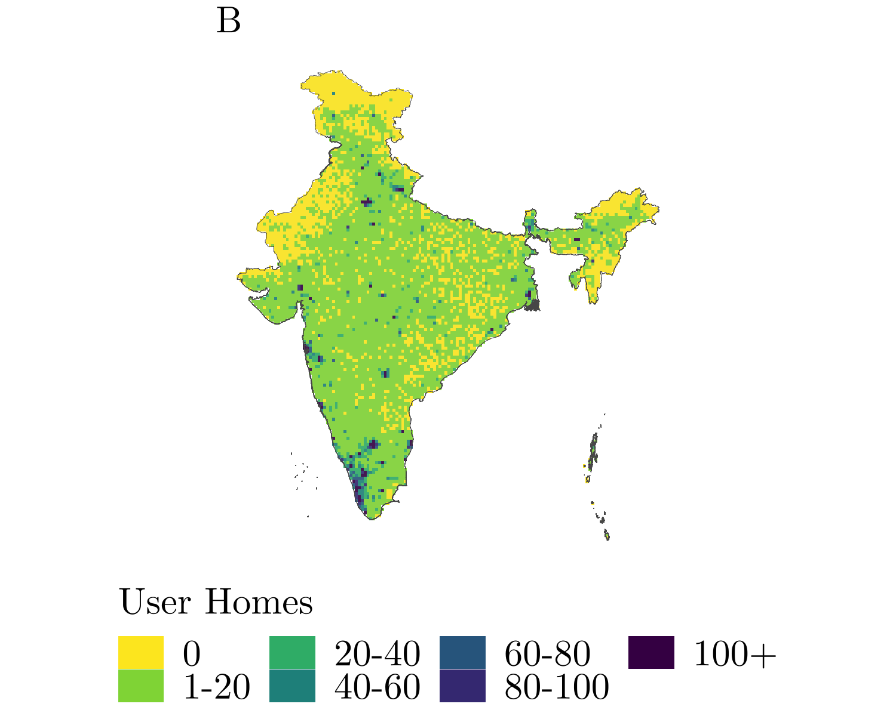
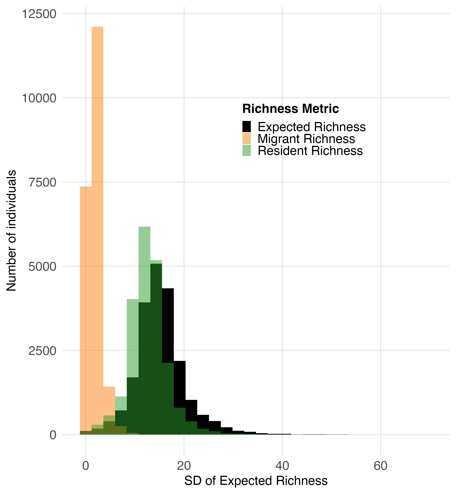
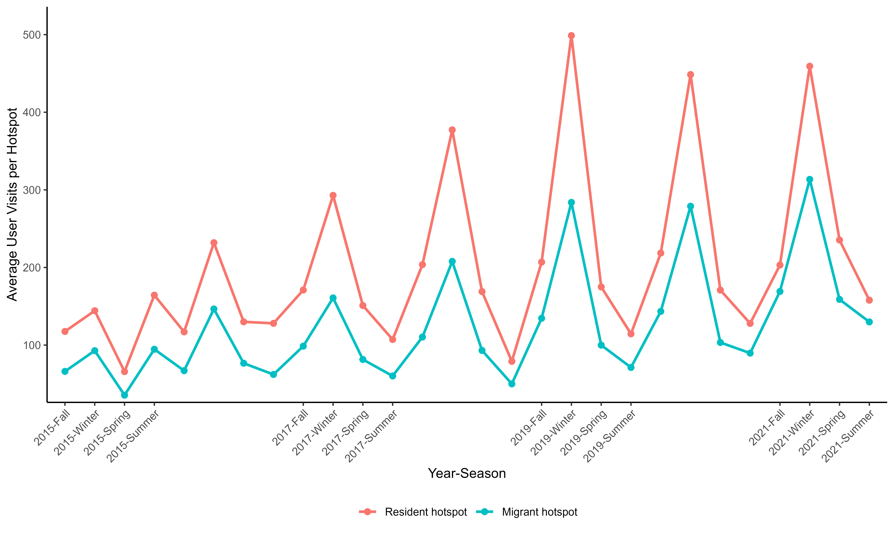
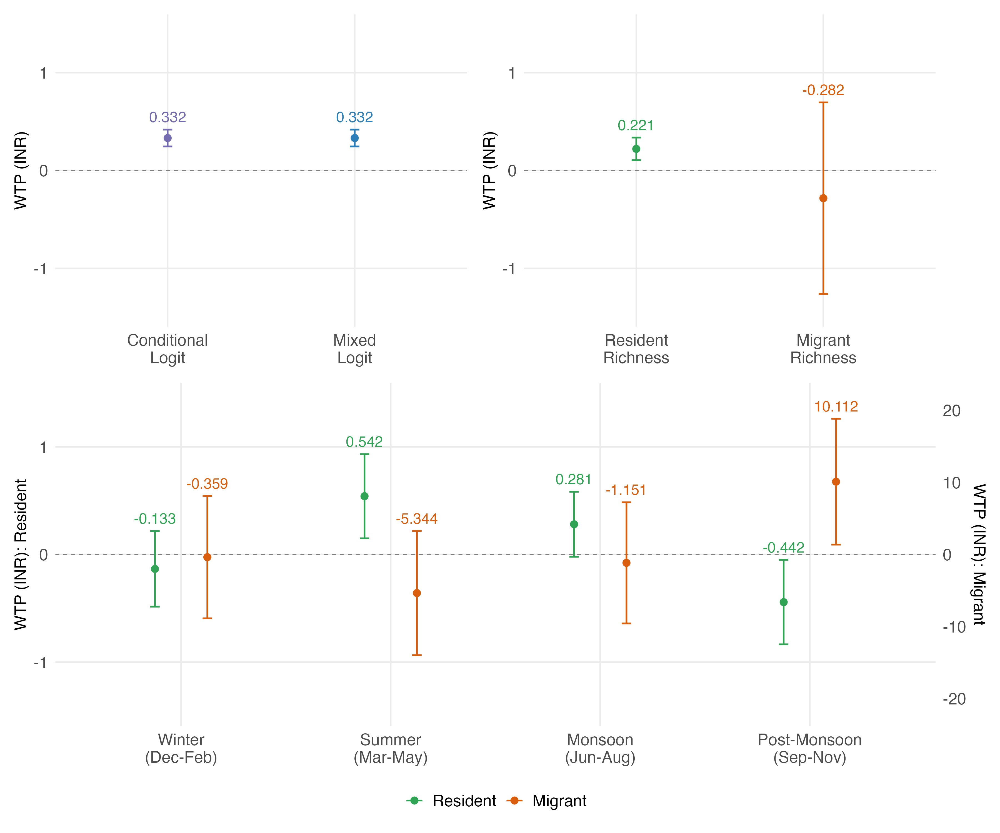

## Introduction
### WTP estimates for environmental quality are concentrated in rich countries

::: {style="font-size: 1.2em;"}
- Willingness-to-pay (WTP) estimates for environmental quality overwhelmingly come from developed countries, and overwhelmingly focus on clean air and water.
- Biodiversity is comparatively neglected, despite growing policy attention (e.g., 30x30, natural capital accounting).
- Developing countries host most of the world's biodiversity and face the steepest tradeoffs between conservation and development, yet we know little about how much people there actually value it.
:::

## Introduction
### This paper

::: {style="font-size: 1.3em;"}
- We provide one of the first estimates of WTP for biodiversity in a developing country.
- Setting: India, via eBird
  - World's most popular birdwatching app, and the largest active citizen-science community in the developing world
- We estimate a recreation demand model on 502,507 birdwatching trips, 21,541 users, and 5,307 hotspots, spanning 2015–2024.
- Approach: random-utility site-choice model $\rightarrow$ mixed logit $\rightarrow$ WTP recovered from the implied compensating travel cost for biodiversity.
:::

## Introduction
### Why citizen science?

::: {style="font-size: 1.3em;"}
- Traditional recreation-demand surveys are expensive and rare in developing countries 
  - Citizen science offers high-frequency, large-N behavioral data at essentially zero marginal cost
- Tradeoff: citizen scientists are self-selected, not a random sample of the population (addressed directly in Stylized Fact 1).
- eBird's structure is well suited to a discrete-choice recreation demand model: GPS-tagged trips, vetted species checklists, and a well-defined set of "hotspots" that function as the choice set.
:::

# Data

## Data
### Overview

{width="70%"}

::: {style="font-size: 0.9em;"}
Panel A: every eBird trip in the sample. Panel B: hotspot clustering (12,400 raw hotspots → 5,307 recreation areas within 5 km). Panel C: imputed vs. self-reported home location for 393 users (median discrepancy ≈ 21 km).
:::

## Data
### Sources

| Dataset | Resolution / Coverage | Role |
|---|---:|---|
| eBird Basic Dataset (2015–2023) | trip-level | Trips, checklists, GPS, protocol, duration |
| eBird Hotspots (API) | point → clustered to 5 km | Choice set / site definitions |
| ERA5 reanalysis [@hoffmann2019] | 0.125° | Monthly temperature & rainfall |
| MODIS VCF [@vcf] | 250 m | Annual forest cover |
| State of India's Birds | species-level | Migratory vs. resident classification |
| GDP per capita grid [@bfi2025] | 25′ | Value of time / travel cost |
| Petroleum Planning & Analysis Cell [@ppac2026] | city-annual | Fuel price → driving cost |
| DHS India | 28,395 clusters | Wealth benchmarking (representativeness) |
| WorldPop | gridded | Population density benchmarking |

## Data {.scrollable}
### Key site attributes ($x'_{ijt}$)

::: {style="font-size: 1.1em;"}
- **Travel cost** $C_{ijt}$: driving cost (fuel + maintenance) + opportunity cost of time (1/3 of local hourly wage), from home to hotspot.
- **Biodiversity** $S_{jt}$: three complementary measures, all constructed as *expected* (pre-trip) values via a hierarchical look-back (previous week → previous month → same season last year):
    - *Species richness*: count of species observed; split into migratory / resident.
- **Other site attributes**: temperature, rainfall, forest cover, and expected congestion (prior-week visitation).
:::

## Data
### Home location & choice sets

::: {style="font-size: 1.2em;"}
- eBird does not require user home addresses
  - Home is imputed as the (outlier-trimmed) gravitational center of each user's trips.
- Validated against 393 users who voluntarily reported their true coordinates: median error ≈ 21 km.
- Choice set = all hotspots within 50 km of home (avg. 118 alternatives)
  - Estimation uses the chosen site + 10 randomly sampled alternatives
  - Standard practice for large choice sets [@Train2009; @becker2025sampling]
:::

## Three stylized facts
### 1. eBird users are wealthier than the average population

::: {style="font-size: 1.15em;"}
Matched to DHS clusters, users live in places with modestly better access to refrigerators, cars, kitchens, and toilets than the national sample.
:::

:::: {.columns}
::: {.column width="50%"}
{width="90%"}
:::
::: {.column width="50%"}
{width="90%"}
:::
::::

## Three stylized facts
### 2. Biodiversity varies substantially across a user's own choice set

::: {style="font-size: 1.15em;"}
Users trade off overall richness, charismatic/aesthetic species, and rarer species when picking where to go.
:::

{width="40%" fig-align="center"}

## Three stylized facts
### 3. Hotspot visitation is strongly seasonal

::: {style="font-size: 1.15em;"}
Winter migratory influx drives up demand, tied to conditions in birds' non-Indian breeding ranges.
:::

{width="80%" fig-align="center"}

# Methodology

## Methodology
### Random utility site-choice model

Individual $i$ chooses site $j$ at time $t$ to maximize utility:

$$
u_{ijt} = \underbrace{x'_{jt}\beta + \delta_{i\times y(t)} + \zeta_{j\times s(t)} + \gamma_{h(t)}}_{v_{ijt}} + \epsilon_{ijt}
$$

| Term | Captures |
|---|---|
| $x'_{jt}\beta$ | travel cost, biodiversity, other site attributes |
| $\delta_{i\times y(t)}$ | individual × year fixed effect (ability, taste) |
| $\zeta_{j\times s(t)}$ | site × season fixed effect (intrinsic attractiveness) |
| $\gamma_{h(t)}$ | hour-of-day fixed effect (availability) |
| $\epsilon_{ijt}$ | i.i.d. Type-1 Extreme Value $\rightarrow$ conditional logit [@McFadden1974] |

## Methodology
### From logit to mixed logit

::: {style="font-size: 1.15em;"}
- A standard conditional logit imposes a *single* preference for biodiversity, $\beta$, across all birders.
- We instead let the marginal utility of biodiversity be a random coefficient:
:::

$$
\beta_i = \bar\beta + \mu_i, \qquad \mu_i \sim \mathcal{N}(0, \sigma_\beta^2)
$$

::: {style="font-size: 1.15em;"}
- $\bar\beta$ = mean preference for biodiversity; $\sigma_\beta$ = heterogeneity across birders (experienced vs. casual, etc.).
- Estimated by simulated maximum likelihood, integrating the logit choice probability over the distribution of $\beta_i$ [@Train2009].
:::

## Methodology
### Recovering WTP

::: {style="font-size: 1.15em;"}
WTP is the compensating travel cost $C^*_{ijkt}$ that leaves $i$ indifferent between the chosen site $j$ and an otherwise-identical alternative $k$:
:::

$$
C^*_{ijkt} = \frac{1}{\alpha}\Big[(\bar\beta+\mu_i)(S_{jt}-S_{kt}) + (\mathbf{X}_{jt}-\mathbf{X}_{kt})'\Omega + (\zeta_j-\zeta_k) + (\epsilon_{ijt}-\epsilon_{ikt})\Big]
$$

::: {style="font-size: 1.2em;"}
Marginal WTP for a unit of biodiversity is then:

$$
MWTP_i = \frac{\partial C^*_{ijkt}}{\partial S_{jt}} = \frac{\bar\beta + \mu_i}{\alpha} \;\Rightarrow\; \text{mean } MWTP = \frac{\bar\beta}{\alpha}
$$

where $\alpha$ is the marginal utility of income (coefficient on travel cost).
:::

# Results

## Results
### Marginal WTP for species richness

{width="60%"}

## Results {.scrollable}
### Fixed-effects robustness: species richness (not wtp-scaled)

::: {style="width: 90%; font-size: 0.8em;"}
| | (1)$^{\dagger}$ | (2)$^{\dagger}$ | (3) | (4) | (5) Main |
|---|---:|---:|---:|---:|---:|
| Species Richness | 0.022 (–) | 0.022 (–) | 0.012\*\*\* (0.002) | 0.014\*\*\* (0.002) | 0.014\*\*\* (0.002) |
| Congestion | 0.439 | 0.436 | 0.134\*\*\* | 0.095\*\*\* | 0.096\*\*\* |
| Log(Travel Cost) | -0.768 | -0.765 | -0.580\*\*\* | -0.568\*\*\* | -0.567\*\*\* |
| SD(Species Richness) | 0.000 | 0.000 | 0.000 | 0.000 | -0.001 |
| Fixed Effects | Individual | Individual × Year | Individual × Year Site | Individual × Year Site × Season | Individual × Year Site × Season Hour |
| N Obs. | 4,418,840 | 4,418,840 | 4,418,840 | 4,418,840 | 4,418,840 |
| N Choice Situations | 441,884 | 441,884 | 441,884 | 441,884 | 441,884 |
| McFadden Pseudo-$R^2$ | 0.230 | 0.230 | 0.145 | 0.129 | 0.129 |
:::

::: {style="font-size: 0.85em;"}
$^{\dagger}$ Numerical Hessian singular under these specs (likely reduced FE absorption leaving shared variation across covariates); point estimates only, no inference yet. Coefficients are on the standardized scale; currency-scaled WTP is in the figure above, not this table.
:::

# Next Steps

## Next Steps
### Alternative biodiversity demand indices

::: {style="font-size: 1.2em;"}
Bring two already-constructed-but-not-yet-estimated indices into the WTP specification, alongside raw species richness:

- **Species appearance index**
  - Observation-weighted mean "conspicuousness" score; tests whether birders are seeking out aesthetically striking species, not just more species.
- **Local rarity index**
  - Hill-type effective rarity, weighting each species by how unusual it is for that observer; tests whether birders are seeking out unusual sightings rather than sheer diversity.
- See whether these shift the main richness coefficient, or capture a distinct margin of preference (diversity- vs. novelty-seeking birders).
:::

## Next Steps
### Individual-level WTP

::: {style="font-size: 1.15em;"}
- Currently we report only the *mean* of the WTP distribution
  - $\bar\beta/\alpha$, i.e. setting $\mu_i = 0$
- The mixed logit estimates a full distribution: $\beta_i = \bar\beta + \mu_i$, $\mu_i \sim \mathcal{N}(0,\sigma_\beta^2)$
  - Recover each user's own $\hat\beta_i$ (and $MWTP_i$) conditional on their observed choice sequence, via the conditional/posterior approach in @Train2009 (Revelt & Train)
- Purpose: test whether WTP varies systematically with birder type
  - Experienced vs. casual
  - Urban vs. rural
:::

## Next Steps
### Addressing endogeneity: demand vs. supply of migratory species

**Concern**: species richness is a choice-model *covariate*, but it may be simultaneously determined with unobserved site quality $\xi_{ijt}$ that also drives utility directly (and/or with observation effort at sites birders already prefer) $\rightarrow$ biasing the richness coefficient.

::: {style="font-size: 0.8em;"}
:::: {.columns}
::: {.column width="50%"}
**Approach**

- A control-function correction [@Bradt2024] 
- Recover $\hat\varepsilon_{ijt}$ from a first-stage regression and including it in the utility function so the remaining error is purged of the endogenous component
:::
::: {.column width="50%"}
**Instrument**

- Bartik / shift-share IV [@Bartik1991] built from H5N1 avian-influenza outbreaks in countries that are breeding grounds for India's migratory species
    - *shift*: H5N1 case counts abroad, weighted by each source country's range-overlap with India
    - *share*: each hotspot's exposure, i.e. the fraction of its species that are migratory
    - Identifying logic: flu shocks abroad shift migratory bird *supply* into India but shouldn't be driven by *local* Indian recreation demand, satisfying shift-share exogeneity [@borusyak2025]
:::
::::
:::

---

## References

::: {#refs}
:::

---

{width="10%" style="position: absolute; top: 50%; left: 50%; transform: translate(-50%, -50%);"}
<!-- ## {background-image="figures/Solo Black Tree Icon PNG.png" background-size="contain" background-repeat="no-repeat" background-position="center"} -->